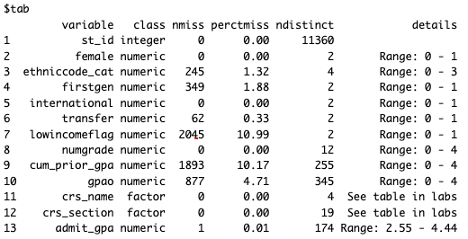
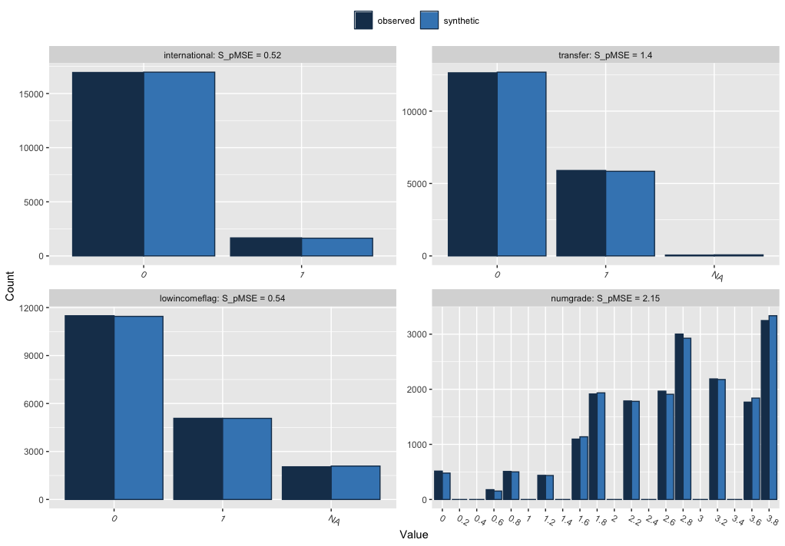
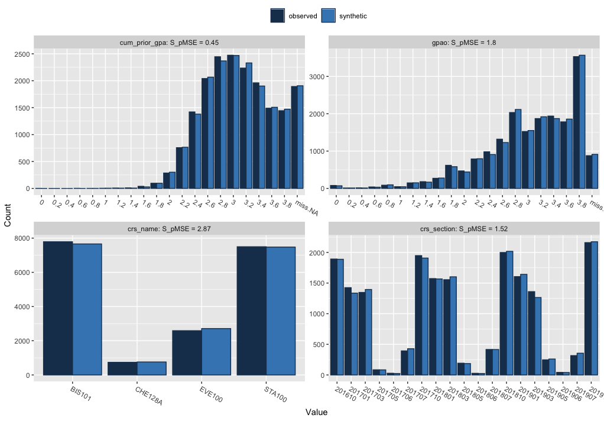

# LAK-sandbox

This repository is a sandbox for the LAK Workshop (March 2023; SEISMIC project) materials. We will create a new public-facing repo for workshop attendees once materials have been finalized (and this repo will be archived at that time).

# Synthetic Data from `synthpop`

Using data from UC Davis courses as a base, Victoria created a synthetic dataset that matches the properties of these courses using the `synthpop` package in R. Learn more about [`synthpop`](https://www.synthpop.org.uk/about-synthpop.html) here: [Generating Synthetic Data Sets with `synthpop` in R \| R-bloggers](https://www.r-bloggers.com/2019/01/generating-synthetic-data-sets-with-synthpop-in-r/)

Code to create and clean synthetic dataset: `synthpop_synthetic_data.R`

Synthetic dataset: `SEISMIC_synthetic_data_2023-01-26.csv`

This synthetic dataset is based off the distributions of real student data from 3 years (fall 2016- fall 2019) of 4 courses: an upper-division Genetics course (BIO300), Organic Chemistry I course (CHEM201), introductory Statistics course (MATH100), and upper-division Evolution course (EVOL305). Course numbers are made up to be illustrative.

Original dataset characteristics:

Comparison of observed and synthetic data for a few select variables:

